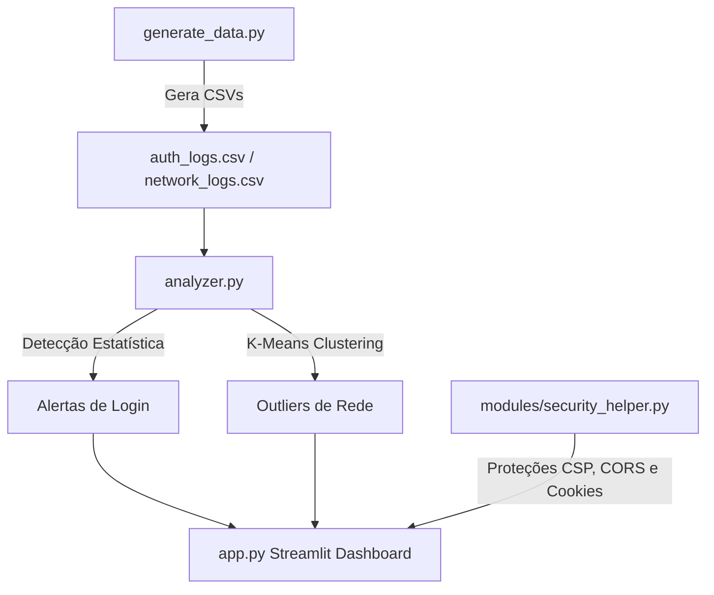

# 🛡️ SIEM do Cientista de Dados (SIEM-Data-Scientist)

Este repositório contém o projeto **SIEM do Cientista de Dados**, desenvolvido para demonstrar como técnicas de Ciência de Dados e Machine Learning podem ser aplicadas de forma prática na detecção de anomalias e ameaças cibernéticas em logs corporativos. 

Sistemas de cibersegurança geram gigabytes de logs por dia (arquivos syslog do Linux, logs do Windows EVTX, logs de proxy/firewall). Para um analista humano, ler tudo é impossível. Este projeto cria uma solução automatizada em Python com um painel moderno e interativo.

---

## 🚀 Como a Aplicação Funciona

O projeto é dividido em três etapas principais: **Simulação (Geração de Dados)**, **Análise e Detecção** e **Visualização Interativa / Hardening**.



### 1. Detecção Estatística (Logs de Autenticação)
Analisamos o comportamento histórico dos usuários (estabelecimento de linha de base ou *baseline*) para identificar desvios anômalos de padrão:
* **Detecção de Força Bruta:** O script calcula uma janela móvel de 5 minutos. Se um usuário tiver mais de 10 tentativas falhas seguidas dentro dessa janela, um alerta é gerado.
* **Acesso fora de hora e localidade incomum:** Com base no comportamento usual (ex: João sempre loga de dia a partir de IPs do Brasil), o script detecta se logins bem-sucedidos ocorrem de madrugada (22h às 06h) ou a partir de um IP com país de origem diferente da sua baseline histórica (ex: Romênia).

### 2. Machine Learning com K-Means (Logs de Conexão de Rede)
Para logs de conexões de rede (onde não há assinaturas estáticas conhecidas), usamos um método não supervisionado de detecção de anomalias:
* **Preparação:** Padronizamos as variáveis tridimensionais da conexão: `bytes_sent` (bytes enviados), `bytes_received` (bytes recebidos) e `duration_seconds` (duração).
* **Agrupamento:** O algoritmo **K-Means** (com $k=3$) agrupa os pontos de conexões de rede normais que possuem tráfegos e durações parecidas.
* **Cálculo de Distância:** Calculamos a distância Euclidiana de cada ponto para o centro (centroide) do seu grupo atribuído.
* **Isolamento de Outliers (Anomalias):** Classificamos como anomalias os pontos no topo do limiar de distância (aquelas conexões muito distantes de qualquer centroide). Isso detecta com precisão:
  - **C2 (Command and Control) Beaconing:** Malware que se comunica periodicamente (baixo tráfego, padrão de duração fixo e incomum).
  - **Exfiltração de Dados:** Grande quantidade de dados enviados de uma vez para um IP externo (`bytes_sent` extremamente alto).

---

## 🔒 Práticas de Segurança e Hardening (OWASP Top 10 & Produção)

Para blindar a aplicação contra vulnerabilidades críticas e prepará-la para um cenário de produção em nuvem (ex: Vercel ou VPS), o projeto incorpora controles inspirados no OWASP Top 10:

* **Higienização e Validação de Entradas (A03:2021-Injection)**:
  - **Filtro de Lista Branca (Allowlist)**: A classe `modules/validation.py` define formatos rígidos de dados esperados (ex: Regex restrita para IPs e caracteres permitidos para login).
  - **Proteção contra XSS**: Escapes automáticos com tratamento HTML de caracteres perigosos (`<`, `>`, `&`, `"`, `'`) antes do processamento ou da renderização.
* **Criptografia e Controle de Acesso (A01:2021-Broken Access Control & A02:2021-Cryptographic Failures)**:
  - **Bcrypt Hashing**: As senhas são cifradas usando `bcrypt` com salt gerado dinamicamente e fator de custo adaptável (rounds=12), evitando algoritmos obsoletos como MD5 ou SHA1.
  - **Princípio do Privilégio Mínimo (RBAC)**: Regras com política padrão de negação (Default Deny), verificando níveis de acesso estruturados dos usuários.
* **Monitoramento e Logs Seguros (A09:2021-Security Logging and Monitoring Failures)**:
  - **Auditoria Centralizada**: Geração de um histórico seguro de ações no servidor (`server_audit.log`).
  - **Mascaramento de Dados (Data Masking)**: Um filtro dinâmico intercepta logs e substitui automaticamente segredos, senhas e tokens por `***MASCARADO***` via Expressões Regulares antes de persistir no arquivo de auditoria.
* **Hardening de Infraestrutura & Front-End**:
  - **Segredos Isolados**: Variáveis confidenciais carregadas de `.env` (em memória) sem prefixos que expõem chaves ao cliente (ex: `NEXT_PUBLIC_`).
  - **Ocultação de Stack Traces**: Streamlit configurado via `.streamlit/config.toml` com `showErrorDetails = false` para prevenir vazamento de dados internos.
  - **Headers de Segurança e Cookies**: Mecanismo de CSP (Content Security Policy) e CORS robusto, além de tratamento de cookies com flags `HttpOnly`, `Secure` e `SameSite=Strict` e rotina de auto-limpeza do `sessionStorage` ao fechar abas do navegador.

---

## 🛠️ Tecnologias Utilizadas

* **Python 3.8+**
* **Pandas & NumPy:** Limpeza, manipulação e engenharia de recursos (features) nos dados de log.
* **Scikit-Learn:** Pré-processamento com `StandardScaler` e algoritmo `KMeans` para clusterização e detecção de outliers.
* **Streamlit:** Construção rápida de uma interface web dinâmica e moderna.
* **Plotly:** Gráficos de dispersão (scatter plots) totalmente interativos e interligados com zoom e tooltips.
* **Python-Dotenv:** Carregamento seguro de segredos de ambiente.

---

## 📦 Como Instalar e Executar

1. **Clone o repositório:**
   ```bash
   git clone https://github.com/MatheusLeo26/SIEM-Data-Scientist.git
   cd SIEM-Data-Scientist
   ```

2. **Crie e ative um ambiente virtual (Recomendado):**
   ```bash
   python -m venv venv
   # No Windows:
   venv\Scripts\activate
   # No Linux/Mac:
   source venv/bin/activate
   ```

3. **Configure as variáveis de ambiente:**
   ```bash
   cp .env.example .env
   ```
   *(Ajuste os valores dentro de `.env` se necessário)*

4. **Instale as dependências:**
   ```bash
   pip install -r requirements.txt
   ```

5. **Gere os dados de teste (opcional, o app faz isso se não existirem):**
   ```bash
   python generate_data.py
   ```

6. **Inicie o Painel Interativo:**
   ```bash
   streamlit run app.py
   ```

---

## 📂 Estrutura de Arquivos

* `generate_data.py`: Script para simular logs realistas, injetando ataques de força bruta, conexões C2 e exfiltração.
* `analyzer.py`: A inteligência do SIEM (processamento pandas, regras estatísticas de login e algoritmo K-Means).
* `app.py`: O frontend do dashboard interativo que exibe os alertas, gráficos de dispersão e o painel de demonstração de segurança.
* `requirements.txt`: Dependências do projeto.
* `.env.example`: Modelo de variáveis de ambiente.
* `.streamlit/config.toml`: Parâmetros de hardening do Streamlit.
* `modules/security_helper.py`: Implementação das melhores práticas de CSP, CORS, Cookies e limpeza de storage.
* `modules/validation.py`: Validador de dados de entrada por Allowlist e prevenção contra ataques XSS.
* `modules/auth.py`: Hashing criptográfico seguro com Bcrypt e controle de acesso RBAC.
* `modules/secure_logger.py`: Auditoria de logs do servidor com filtro ativo de mascaramento de dados confidenciais.
