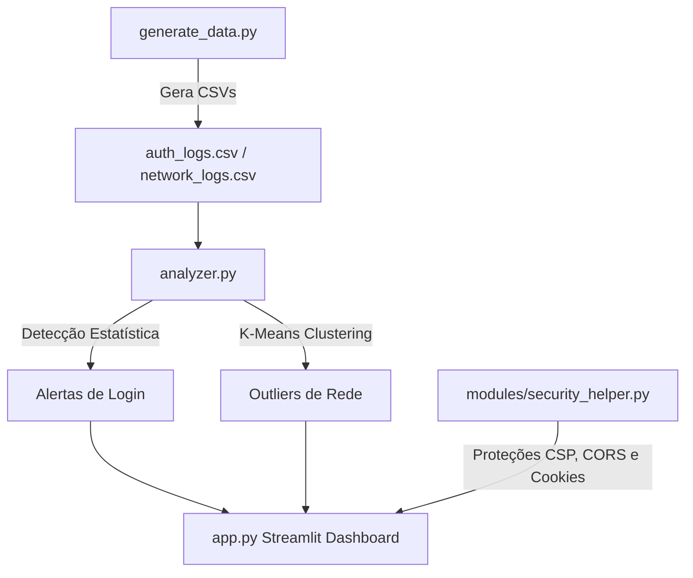

# 🛡️ SIEM do Cientista de Dados (SIEM-Data-Scientist)

Este repositório contém o projeto **SIEM do Cientista de Dados**, desenvolvido para demonstrar como técnicas de Ciência de Dados e Machine Learning podem ser aplicadas de forma prática na detecção de anomalias e ameaças cibernéticas em logs corporativos. 

Sistemas de cibersegurança geram gigabytes de logs por dia (arquivos syslog do Linux, logs do Windows EVTX, logs de proxy/firewall). Para um analista humano, ler tudo é impossível. Este projeto cria uma solução automatizada em Python com um painel moderno e interativo.

---

## 🚀 Como a Aplicação Funciona

O projeto é dividido em três etapas principais: **Simulação (Geração de Dados)**, **Análise e Detecção** e **Visualização Interativa / Hardening**.



### 1. Detecção Estatística (Logs de Autenticação)
Analisamos o comportamento histórico dos usuários (estabelecimento de linha de base ou *baseline*) para identificar desvios anômalos de padrão:
* **Detecção de Força Bruta:** O script calcula uma janela móvel de 5 minutos. Se um usuário tiver mais de 10 tentativas falhas seguidas dentro dessa janela, um alerta é gerado.
* **Acesso fora de hora e localidade incomum:** Com base no comportamento usual (ex: João sempre loga de dia a partir de IPs do Brasil), o script detecta se logins bem-sucedidos ocorrem de madrugada (22h às 06h) ou a partir de um IP com país de origem diferente da sua baseline histórica (ex: Romênia).

### 2. Machine Learning com K-Means (Logs de Conexão de Rede)
Para logs de conexões de rede (onde não há assinaturas estáticas conhecidas), usamos um método não supervisionado de detecção de anomalias:
* **Preparação:** Padronizamos as variáveis tridimensionais da conexão: `bytes_sent` (bytes enviados), `bytes_received` (bytes recebidos) e `duration_seconds` (duração).
* **Agrupamento:** O algoritmo **K-Means** (com $k=3$) agrupa os pontos de conexões de rede normais que possuem tráfegos e durações parecidas.
* **Cálculo de Distância:** Calculamos a distância Euclidiana de cada ponto para o centro (centroide) do seu grupo atribuído.
* **Isolamento de Outliers (Anomalias):** Classificamos como anomalias os pontos no topo do limiar de distância (aquelas conexões muito distantes de qualquer centroide). Isso detecta com precisão:
  - **C2 (Command and Control) Beaconing:** Malware que se comunica periodicamente (baixo tráfego, padrão de duração fixo e incomum).
  - **Exfiltração de Dados:** Grande quantidade de dados enviados de uma vez para um IP externo (`bytes_sent` extremamente alto).

---

## 🔒 Práticas de Segurança e Hardening (Pronto para Produção)

Para preparar o projeto para publicação em nuvem (ex: Vercel ou VPS) de forma segura, implementamos os seguintes controles:
* **Gerenciamento de Segredos**: Toda configuração confidencial é isolada do código e lida da memória usando `python-dotenv`. Nenhuma chave possui o prefixo de exposição pública (ex: `NEXT_PUBLIC_`), garantindo que segredos permaneçam no servidor.
* **Ocultação de Stack Traces**: O Streamlit está configurado via `.streamlit/config.toml` com `showErrorDetails = false`. Detalhes de exceções internas e caminhos de pastas locais não vazam para o navegador do cliente.
* **Política CORS & CSP**: Proteções nativas ativadas contra conexões de origens não autorizadas (CORS) e políticas restritas de Content Security Policy (CSP) contra injeção de scripts maliciosos (XSS).
* **Cookies e Sanitização de Storages**:
  - Funções prontas para emissão de cookies de sessão com as flags `HttpOnly` (indisponível para scripts JS), `Secure` (apenas tráfego HTTPS criptografado) e `SameSite=Strict` (imunidade a CSRF).
  - Limpeza automática de `localStorage` e `sessionStorage` disparada no navegador do usuário no momento em que ele fecha a aba.

---

## 🛠️ Tecnologias Utilizadas

* **Python 3.8+**
* **Pandas & NumPy:** Limpeza, manipulação e engenharia de recursos (features) nos dados de log.
* **Scikit-Learn:** Pré-processamento com `StandardScaler` e algoritmo `KMeans` para clusterização e detecção de outliers.
* **Streamlit:** Construção rápida de uma interface web dinâmica e moderna.
* **Plotly:** Gráficos de dispersão (scatter plots) totalmente interativos e interligados com zoom e tooltips.
* **Python-Dotenv:** Carregamento seguro de segredos de ambiente.

---

## 📦 Como Instalar e Executar

1. **Clone o repositório:**
   ```bash
   git clone https://github.com/MatheusLeo26/SIEM-Data-Scientist.git
   cd SIEM-Data-Scientist
   ```

2. **Crie e ative um ambiente virtual (Recomendado):**
   ```bash
   python -m venv venv
   # No Windows:
   venv\Scripts\activate
   # No Linux/Mac:
   source venv/bin/activate
   ```

3. **Configure as variáveis de ambiente:**
   ```bash
   cp .env.example .env
   ```
   *(Ajuste os valores dentro de `.env` se necessário)*

4. **Instale as dependências:**
   ```bash
   pip install -r requirements.txt
   ```

5. **Gere os dados de teste (opcional, o app faz isso se não existirem):**
   ```bash
   python generate_data.py
   ```

6. **Inicie o Painel Interativo:**
   ```bash
   streamlit run app.py
   ```

---

## 📂 Estrutura de Arquivos

* `generate_data.py`: Script para simular logs realistas, injetando ataques de força bruta, conexões C2 e exfiltração.
* `analyzer.py`: A inteligência do SIEM (processamento pandas, regras estatísticas de login e algoritmo K-Means).
* `app.py`: O frontend do dashboard interativo que exibe os alertas e gráficos de dispersão.
* `requirements.txt`: Dependências do projeto.
* `.env.example`: Modelo de variáveis de ambiente.
* `.streamlit/config.toml`: Parâmetros de hardening do Streamlit.
* `modules/security_helper.py`: Implementação das melhores práticas de CSP, CORS, Cookies e limpeza de localStorage.
